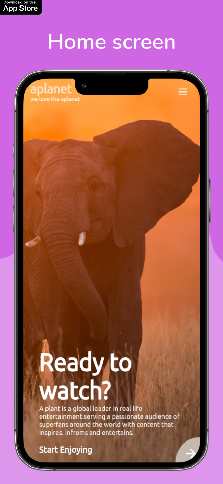
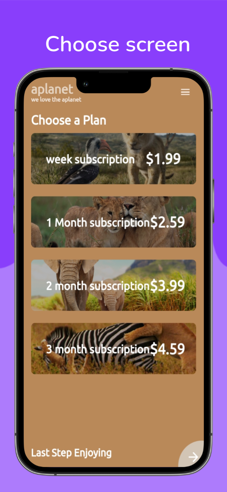
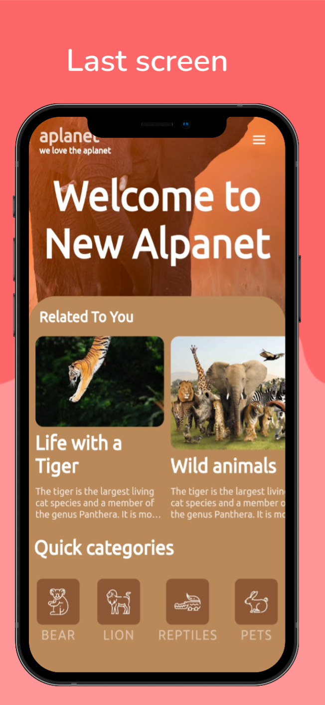

# Flutter Animal Plant UI Desgin

A animal plant app fro Android.Written in Flutter.This app is static. I mean, This is a UI design. No backend.

## ScreenShots

<table>
    <tr>
        <td></td>
        <td></td>
        <td></td>
    </tr>
</table>

## Android Application Package
Install APK [Click](https://muhammedanjoom.github.io/)

## Building

-Install Flutter
- `flutter pub get`
- `flutter run`

